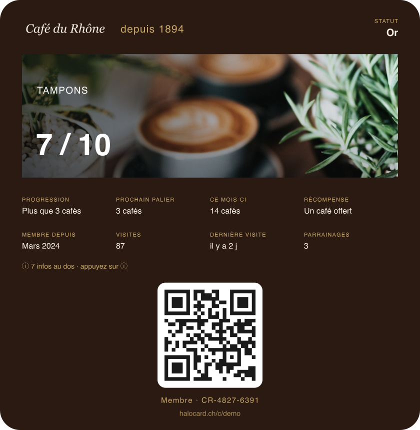
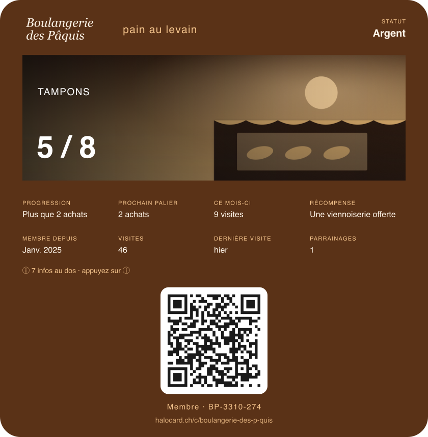
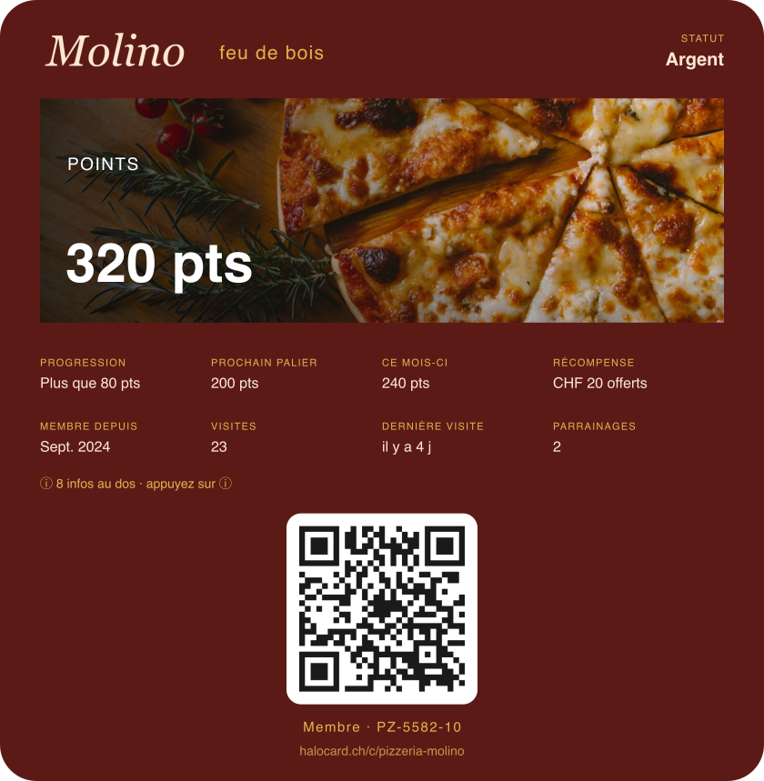
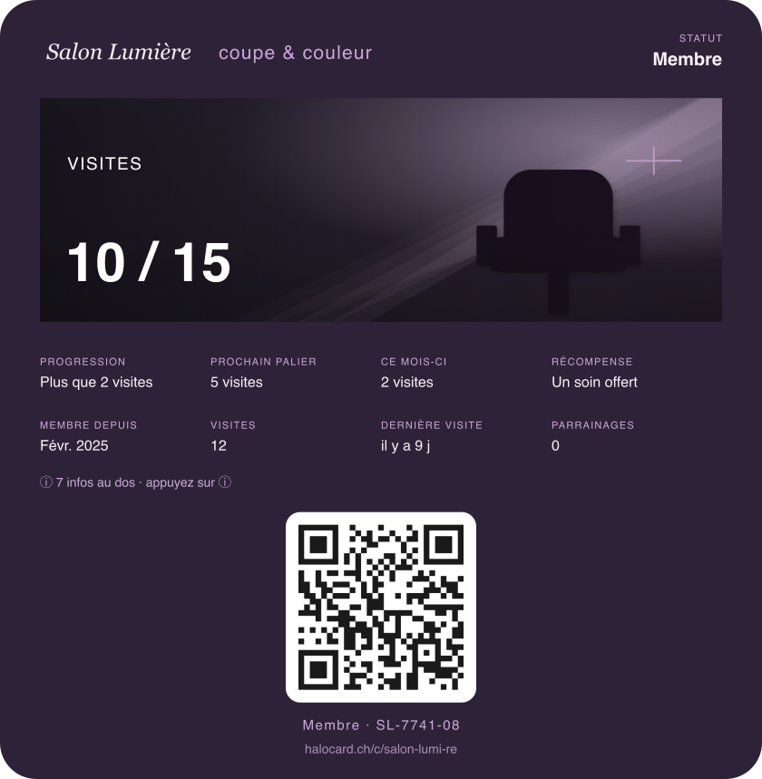
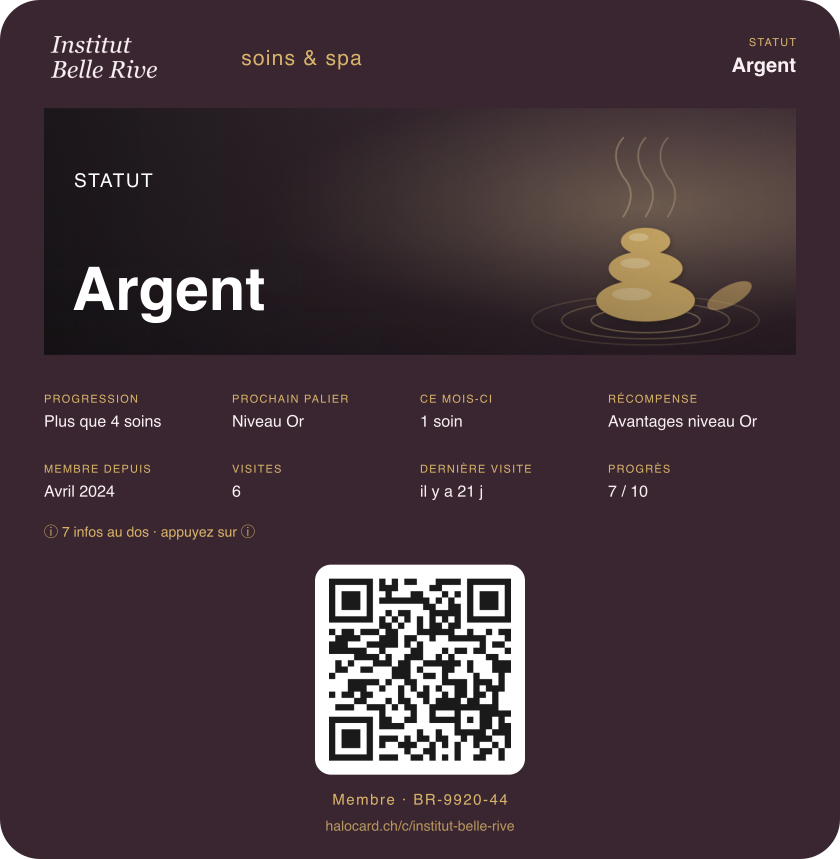
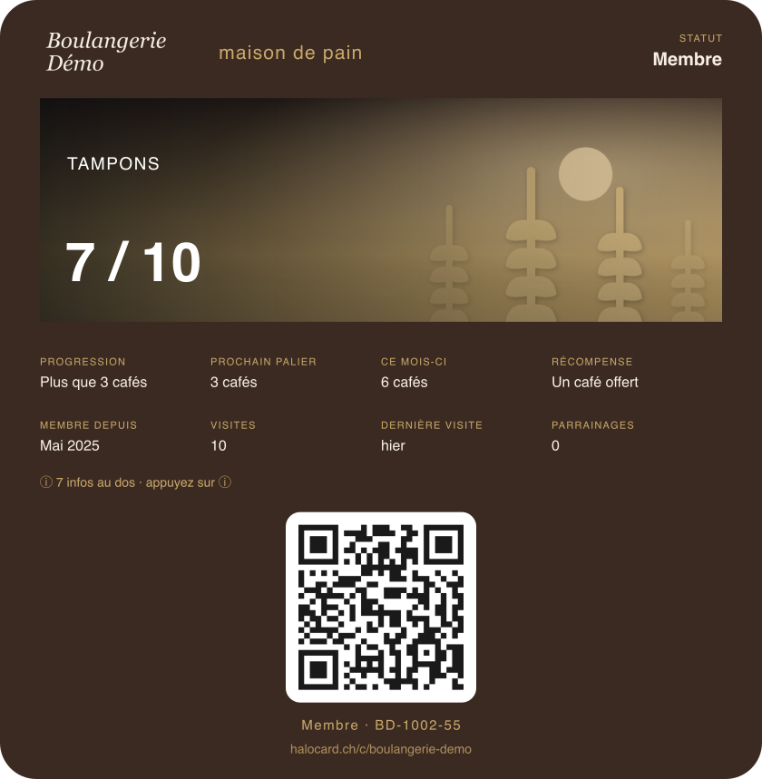

# Planche-contact — Kit démo HaloCard

Aperçus hors-ligne des 6 cartes démo (façon Apple Wallet) + QR d'enrôlement.
Pour montrer le rendu au commerçant même sans réseau. Imprimable.

> Générée par `node scripts/render-demo-contact-sheet.mjs` —
> aperçus : `assets/demo-kit/preview/<slug>.png` · QR : `assets/demo-kit/<slug>/qr.png`.
> Détails et identifiants : [DEMO-KIT.md](./DEMO-KIT.md).

---

### ☕ Café du Rhône — carte à tampons (QR)
Tampons 10 + bienvenue + palier 5 · avis Google · `https://halocard.ch/c/demo`

---

### 🥐 Boulangerie des Pâquis — carte à tampons (AZTEC)
8 achats → 1 viennoiserie · `https://halocard.ch/c/boulangerie-des-p-quis`

---

### 🍕 Pizzeria Molino — carte à points (QR)
1 pt/CHF · CHF 20 offerts à 200 pts · `https://halocard.ch/c/pizzeria-molino`

---

### ✂️ Salon Lumière — carte à visites (PDF417)
Récompenses à 5, 10 et 15 visites · `https://halocard.ch/c/salon-lumi-re`

---

### 🌸 Institut Belle Rive — carte à niveaux (QR)
Bronze (3) · Argent (6) · Or (10) · `https://halocard.ch/c/institut-belle-rive`

---

### ☕ Boulangerie Démo — carte à tampons (CODE128)
Compte de secours · 10 + bienvenue · `https://halocard.ch/c/boulangerie-demo`

