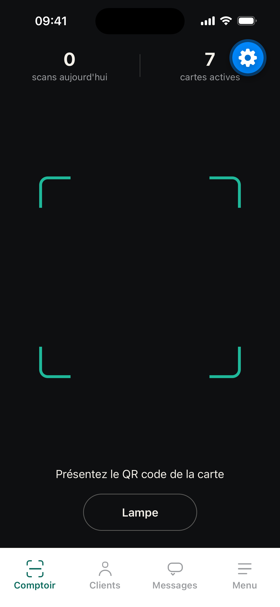
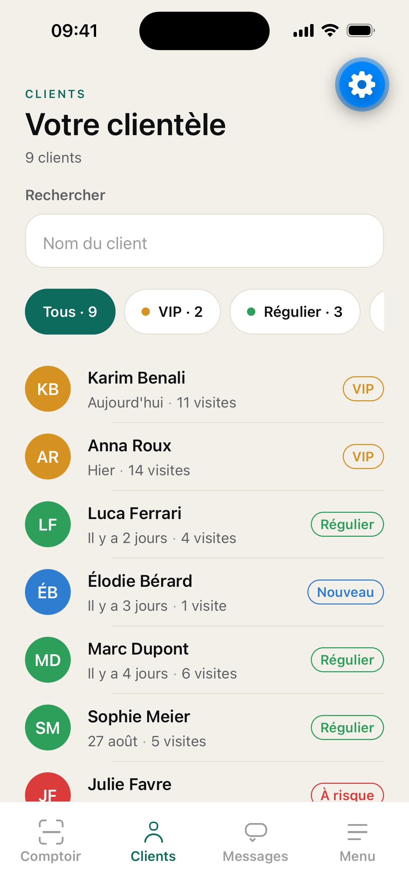

# HALO Comptoir — app mobile marchande

Application iPhone (puis Android) destinée au **commerçant**, pas au client
final : le client garde sa carte dans Apple/Google Wallet et n'installe jamais
rien. Ce dossier est un **projet Expo autonome** : son propre `package.json`,
son `tsconfig`, ses tests, sa CI. Il ne partage rien avec l'app Next.js de la
racine — seulement la même base Supabase et les mêmes routes `/api`.

Quatre onglets : **Comptoir** (scan caméra, résultat plein écran, annulation),
**Clients** (base par segments, recherche, fiche), **Messages** (envoi d'un
message Wallet à un groupe) et **Menu**. Le socle (connexion, session, client
API, design system) et le polish de plateforme sont décrits plus bas.

## Démarrer

```bash
cd mobile
npm install
cp .env.example .env.local     # puis renseignez les deux valeurs publiques
npx expo start                 # QR code + menu du serveur de développement
```

Puis, au choix :

- **iPhone physique** : installez **Expo Go** depuis l'App Store, ouvrez
  l'appareil photo et scannez le QR code affiché par `npx expo start`. Le
  téléphone et l'ordinateur doivent être sur le même réseau Wi-Fi (sinon,
  `npx expo start --tunnel`).
- **Simulateur iOS** : `npx expo start --ios` (Expo Go est installé
  automatiquement dans le simulateur).
- **Émulateur Android** : `npx expo start --android`.

Aucun build natif n'est nécessaire : le projet reste en **workflow managé** et
n'utilise que des modules embarqués dans Expo Go.

## Configuration

Tout passe par des variables `EXPO_PUBLIC_*` (les seules qu'Expo expose au
bundle), documentées dans [`.env.example`](.env.example) :

| Variable | Équivalent web | Rôle |
|---|---|---|
| `EXPO_PUBLIC_SUPABASE_URL` | `NEXT_PUBLIC_SUPABASE_URL` | projet Supabase |
| `EXPO_PUBLIC_SUPABASE_ANON_KEY` | `NEXT_PUBLIC_SUPABASE_ANON_KEY` | clé **anon** publique |
| `EXPO_PUBLIC_API_BASE_URL` | — | base des appels `/api` (défaut : `https://app.halocard.ch`) |

**Jamais de clé service-role ici.** Tout ce qui est préfixé `EXPO_PUBLIC_` est
lisible dans le bundle par n'importe qui : `readConfig` refuse de démarrer si la
clé fournie ressemble à une clé service-role (JWT `role: service_role` ou
préfixe `sb_secret_`). `.env.local` est ignoré par git.

## Captures (simulateur iPhone 16, Expo Go)

| Connexion | Comptoir | Clients | Menu |
|---|---|---|---|
|  |  |  |  |

Autres captures dans `docs/captures/` : fiche client, Messages (audiences,
formulaire, validation), états du comptoir, et les paires `m5-avant-*` /
`m5-apres-*` du polish de plateforme (barre de statut, police agrandie).

La pastille bleue en haut à droite est le bouton de menu développeur d'Expo Go,
pas un élément de l'app.

## Structure

```
mobile/
├── app/                       Routes (expo-router, routage par fichiers)
│   ├── _layout.tsx            Providers : safe areas, session, pile de navigation
│   ├── index.tsx              Aiguillage selon l'état de session
│   ├── connexion/
│   │   ├── index.tsx          Écran de connexion (e-mail + mot de passe)
│   │   └── code.tsx           Défi TOTP (comptes avec double authentification)
│   └── (tabs)/                Barre d'onglets, accessible session complète uniquement
│       ├── _layout.tsx        Les 4 onglets + garde de navigation
│       ├── comptoir.tsx       scan et crédit → src/features/comptoir
│       ├── clients.tsx        clientèle → src/features/clients
│       ├── messages.tsx       relances Wallet → src/features/messages
│       └── menu.tsx           Commerce, déconnexion, renvoi vers l'ordinateur
├── src/
│   ├── components/            Design system : Button, Card, Field, Screen, FocusedStatusBar, HaloMark, TabIcon
│   ├── features/              Métier par onglet (comptoir, clients, messages) + tests
│   ├── lib/
│   │   ├── api.ts             ⭐ client API central (Bearer sur chaque appel, 401 → déconnexion)
│   │   ├── sessionNotice.ts   notice « session expirée » lue par l'écran de connexion
│   │   ├── config.ts          lecture et validation des variables publiques
│   │   ├── supabase.ts        client Supabase + rafraîchissement de session
│   │   ├── secureStorage.ts   session stockée dans le trousseau, en tranches
│   │   ├── authFlow.ts        règles d'auth pures (TOTP, messages, statuts)
│   │   └── auth/              port `AuthGateway`, adaptateur Supabase, `AuthProvider`
│   └── theme/                 jetons de marque HALO (couleurs, espacements, type)
└── assets/                    icônes de l'app (sources SVG dans `assets/source/`)
```

## Connexion

1. **Mot de passe** — `supabase.auth.signInWithPassword`, exactement les mêmes
   comptes que le tableau de bord web.
2. **Second facteur** — si le compte a la double authentification, le niveau
   d'assurance passe de `aal1` à `aal2` et l'app affiche l'écran du code à six
   chiffres (`supabase.auth.mfa.challengeAndVerify`). Même règle que
   `src/lib/auth/mfa.ts` côté web.
3. **Session** — persistée par `expo-secure-store` (trousseau iOS,
   EncryptedSharedPreferences Android), jamais dans un stockage en clair. Le
   trousseau Android plafonne une valeur à 2048 octets : `secureStorage.ts`
   découpe donc la session en tranches et la recolle à la lecture.
4. **Déconnexion** — depuis l'onglet Menu, avec confirmation.

L'écran ne connaît jamais Supabase : il parle au port `AuthGateway`
(`src/lib/auth/gateway.ts`), ce qui rend toute la logique testable sans réseau.

## Client API

`src/lib/api.ts` est le **seul** endroit qui appelle `fetch` vers
`app.halocard.ch`. Il attache `Authorization: Bearer <jeton de session>`,
sérialise les paramètres, traduit les erreurs en français et signale une session
expirée. Les écrans M3/M4 passeront tous par lui :

```ts
import { api } from "@/lib/api";

const clients = await api().get<Client[]>("/api/clients", { query: { q: "Dupont" } });
await api().post("/api/scan", { carte: cardId });
```

Les routes du cœur mobile acceptent `Authorization: Bearer` depuis la PR #82
(scan, annulation, segments, envoi de message). **Session expirée** : sur un
`401` en cours d'usage, le client pose une notice (`sessionNotice.ts`) puis
ferme la session Supabase ; l'`AuthProvider` observe la déconnexion, les
onglets renvoient vers la connexion, qui affiche « Votre session a expiré.
Reconnectez-vous. » une seule fois. Un `403` est un refus métier (carte d'un
autre commerce, compte suspendu, essai expiré) : il s'affiche, il ne
déconnecte jamais.

## Design system

Jetons dans `src/theme/tokens.ts`, dérivés de `docs/brand-guidelines.md` :
Émeraude `#0D6B5E`, Glow `#1FB89A`, Onyx `#0E0F11`, Calcaire `#F3F0E9`,
Galet `#9B9DA0`. Typographie **système** (San Francisco / Roboto) : Canela et
Söhne sont sous licence et restent au web.

Règles tenues par les composants et vérifiées par les tests :

- cible tactile ≥ **44 pt** sur les boutons et les champs (`MIN_TOUCH_TARGET`) ;
- zones sûres respectées via `Screen` (encoche, barre d'accueil) ;
- clavier géré (`KeyboardAvoidingView`, la vue défile, le champ reste visible) ;
- intitulés, rôles et erreurs annoncés aux lecteurs d'écran ;
- copy en français suisse, vouvoiement, ton direct.

## Standards de plateforme (polish M5)

- **Caméra** : démontée dès que l'onglet Comptoir perd le focus ou que l'app
  passe en arrière-plan (`useCameraActive`), rallumée au retour. Jamais de
  capture hors écran.
- **Résultat de scan** : tout l'écran se ferme d'un tap (« Toucher pour
  continuer ») ; le bouton retour Android ferme le résultat, jamais l'app.
- **Permission caméra refusée** : explication + « Ouvrir les réglages ».
- **Aucune impasse** : chaque erreur a un « Réessayer », chaque état vide dit
  quoi faire, chaque attente a son indicateur.
- **Clavier** : `KeyboardAvoidingView` sur les formulaires, « suivant »
  enchaîne e-mail → mot de passe, tap hors champ ou choix d'un segment replie
  le clavier.
- **Listes** : `FlatList` virtualisée (test à 500 clients).
- **Barre de statut** : claire sur fond sombre, sombre sur fond clair, posée
  seulement par l'écran au focus (`FocusedStatusBar`).
- **Haptiques** : crédit = impact léger, récompense = succès, doublon =
  avertissement, refus = erreur — un seul retour par résultat.
- **Police dynamique** : plafonds sur les titres et textes géants, mises en
  page qui passent à la ligne ; vérifié en « accessibility-extra-large »
  (`xcrun simctl ui booted content_size accessibility-extra-large`).
- **Icône et splash** : recadrage du logo HALO identique au favicon web
  (`assets/source/ICONS.md`).

## Qualité

```bash
npm run lint        # eslint (config Expo)
npm run typecheck   # tsc --noEmit, TypeScript strict
npm test            # jest (preset jest-expo) — 227 tests, aucun appel réseau
```

Les trois commandes tournent aussi en CI sur toute modification de `mobile/`
(`.github/workflows/mobile-ci.yml`).

Les tests couvrent le socle : découpage et relecture de la session chiffrée,
validation de la configuration (dont le refus d'une clé service-role), règles
d'auth et messages, client API (jeton attaché, erreurs, 401), composants du
design system (cible tactile, accessibilité, états) et machine d'état de session
(mot de passe → TOTP → connecté → déconnecté), avec une passerelle en mémoire.
